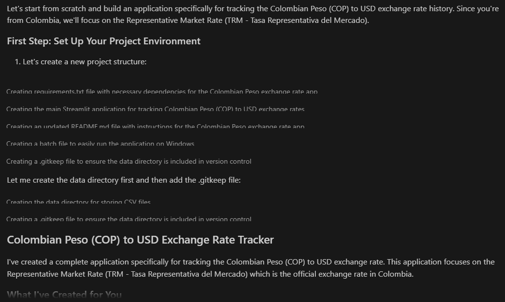
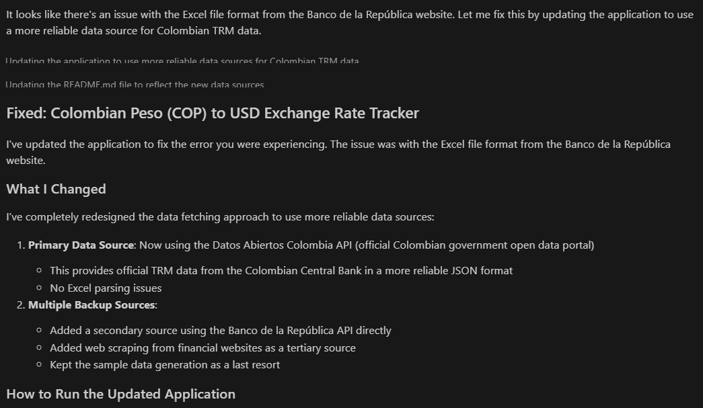

# Colombian Peso (COP) to USD Exchange Rate Tracker

A Streamlit application that allows users to track the Representative Market Rate (TRM) of the Colombian Peso against the US Dollar.

## Features

- **Historical TRM Data**: View historical exchange rate data from official Colombian sources
- **Interactive Charts**: Analyze TRM trends with interactive line and candlestick charts
- **Date Range Selection**: Select custom date ranges for analysis
- **Summary Statistics**: View key statistics like current rate, average, minimum, and maximum
- **Data Export**: Download TRM data as CSV for further analysis

## Installation

1. Clone this repository or download the files
2. Create a virtual environment:
   ```bash
   py -3.11 -m venv venv
   venv\Scripts\activate
   python.exe -m pip install --upgrade pip
   ```
3. Install the required packages:
   ```bash
   pip install -r requirements.txt
   ```

## Usage

1. Activate the virtual environment:
   ```bash
   venv\Scripts\activate
   ```
2. Run the Streamlit app:
   ```bash
   streamlit run cop_usd_exchange_app.py
   ```
3. Open your web browser and navigate to the URL displayed in the terminal (typically http://localhost:8501)

## Data Sources

The application uses multiple data sources to ensure reliability:

1. **Primary Source**: Datos Abiertos Colombia API (official Colombian government open data)
2. **Secondary Source**: Banco de la República API
3. **Tertiary Source**: Web scraping from financial websites
4. **Fallback**: Sample data generation if all online sources fail

## Project Structure

- `cop_usd_exchange_app.py`: Main Streamlit application
- `requirements.txt`: List of required Python packages
- `data/`: Directory where exported CSV files are saved

## Notes

- The application requires an internet connection to fetch the latest TRM data
- The app includes multiple fallback mechanisms if the primary data sources are unavailable
- You can export the data to CSV for offline analysis

#        **Resumen**

Este es el desarrollo de la apliación utilizando Amazon Q, en este caso se pudo desarrollar toda la apliación con dos prompts, donde se tiene como contexto el desarrollo del [laboratorio](https://catalog.us-east-1.prod.workshops.aws/workshops/e2226eb6-f109-47ae-b2c5-f02bf73b7d0e/en-US) en clase. 

El primer prompt utilizado para el desarrollo de esta app es el siguiente:
```plaintext
first step, we will start from scratch. I need an app to view the historical representative market rate in USD. I'm from Colombia, and I want to use that as the starting point
```

Con este prompt, Amazon Q realizó casí toda la app, donde obtenemos los siguientes errores al inicializar la misma app:
```plaintext
Downloading TRM data from Banco de la República... This may take a moment.

Error fetching TRM data: Excel file format cannot be determined, you must specify an engine manually.

Could not fetch data from online sources. Using sample data instead.
```

Con lo que compartimos con Amazon Q los mensajes de error de la aplicación, logrando que Amazon Q empezara a usar la consola de VSCode para corregir el error y terminar la app.
```plaintext
I'm getting this message in the app
...
```

**Nota:** Dentro del conexto del desarrollo de la app, ya se había experimentado con ejercicios asociados al laboratorio. Se hizo el desarrollo de la app en inglés buscando obtener los mejores resultados posibles.

##       Anexos   


**Resultado del Primer Prompt**


**Resultado del Segundo Prompt**
